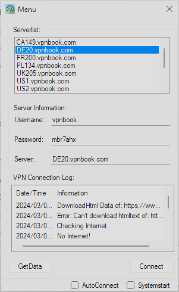

# VPN Client with Free VPNServer and automatically read out password

This is a simple VPN client that runs in the background, allowing users to select servers and connect or disconnect through the tray icon.
Using free VPNServer: https://www.vpnbook.com/

## Features
- **Password readout:** Downloading the Password Image and using Tesseract to read out the Chars.
- **Server Selection:** Choose from a list of available servers to connect to the VPN.
- **Background Operation:** The application runs discreetly in the background without disrupting normal computer usage.
- **Tray Icon Control:** Open the menu and control the VPN connection directly through the tray icon.

## Installation

1. Download the latest version of the application here: 
2. Start the Application inside the Folder.

## Usage

1. Launch the application.
2. Right-click on the tray icon to open the menu.
3. Open Menu.
4. Connect or disconnect from the selected server through the tray icon.

## Requirements

- Windows operating system
- .NET Framework 4.7.2"

## Contributing

If you find bugs or want to suggest improvements, please create an issue or pull request in this repository.